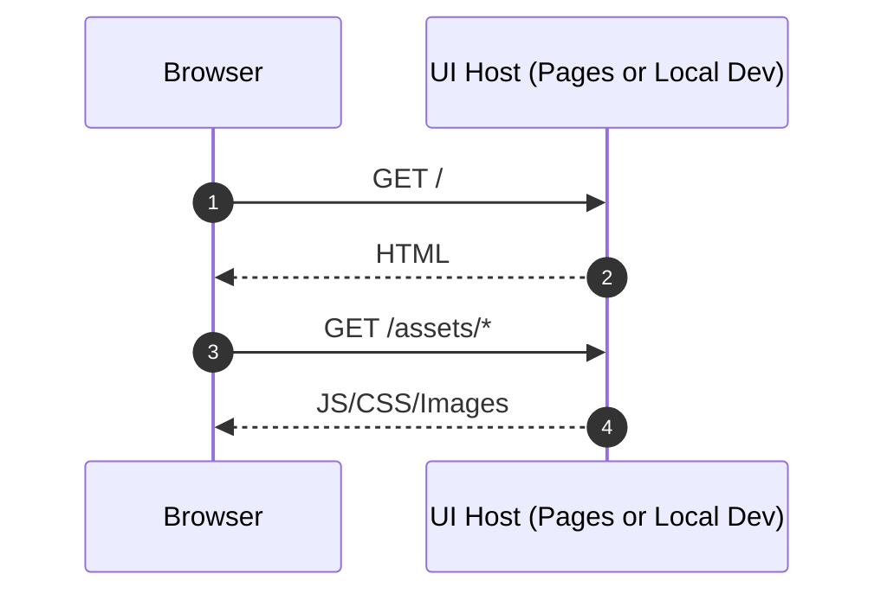
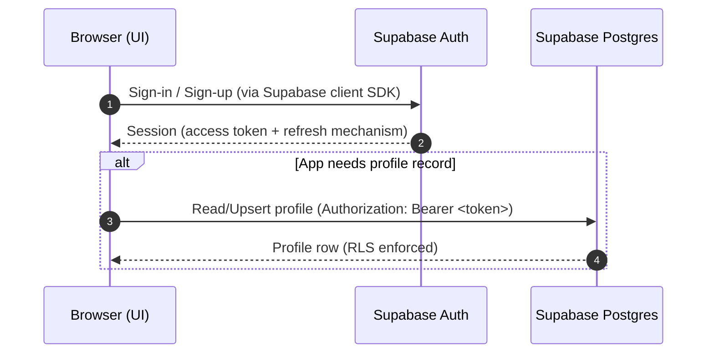
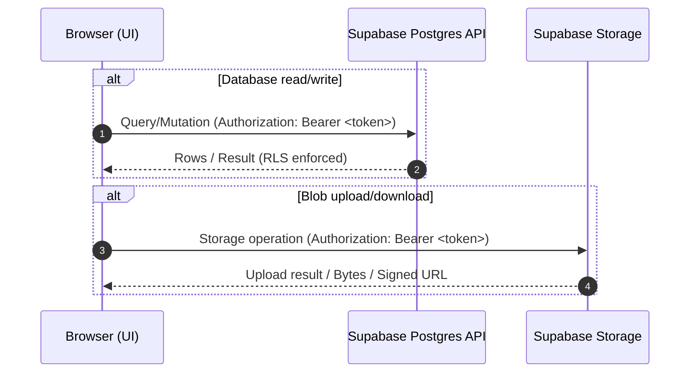
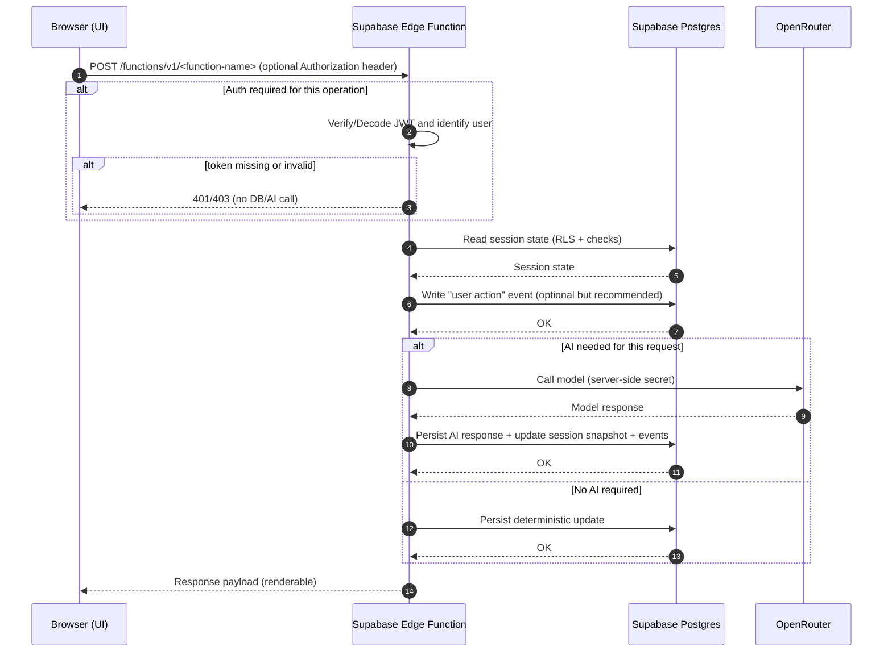

# Mystery Game Architecture

## Decision summary

We will build the Mystery Game using:

- **UI**: SvelteKit + Vite, deployed as a **static site** (no SSR runtime in cloud).
- **Hosting (UI)**: Cloudflare Pages serves the static bundle.
- **Backend platform**: Supabase
  - **AuthN**: Supabase Auth (optional depending on features)
  - **AuthZ**: Postgres Row Level Security (RLS)
  - **Database**: Postgres
  - **Blob storage**: Supabase Storage
  - **AI server-side execution**: Supabase Edge Functions (Deno runtime)
  - **Model provider**: OpenRouter called from Edge Functions using server-side secrets

Primary goals:

- **Local dev simplicity**: one command starts UI + backend + database.
- **Testability**: unit, integration, and E2E tests that exercise each component and the full stack.
- **Simplicity**: minimize bespoke backend infrastructure; keep secrets off the client.

Non-goals (for now):

- SSR hosting for the app itself (we accept static UI + client-side data loading).
- Always-on custom backend server.

---

## Components and responsibilities

### UI (SvelteKit static)

Responsibilities:

- Render gameplay UI, manage client state, and call backend APIs.
- Handle authentication UX using Supabase client SDK.
- Call Edge Functions for AI-backed turns (never call OpenRouter directly).

Constraints:

- **No secrets** in the browser bundle.
- Be tolerant of network failures (retries, optimistic UI as needed).

### Supabase Auth

Responsibilities:

- Issue user sessions/tokens.
- Support optional auth (some features may be public).

### Postgres (Supabase)

Responsibilities:

- Persist game sessions, event logs, and derived state.
- Enforce authorization via **RLS**.

Recommended pattern:

- Maintain an **append-only event log** for turns and actions.
- Maintain a current “session snapshot” for fast reads.

### Supabase Storage

Responsibilities:

- Store user uploads, generated images, and other blobs.
- Access is controlled via Storage policies and/or DB checks.

### Supabase Edge Functions

Responsibilities:

- Verify identity (optional auth depending on route).
- Perform server-side operations that must remain secret:
  - OpenRouter calls (API key)
  - privileged DB mutations
- Persist results into Postgres and return response payloads to UI.

---

## URL shapes (no endpoint name assumptions)

We avoid hardcoding endpoint names throughout the codebase.

- **UI origin**
  - Cloud: `https://<ui-host>`
  - Local: `http://localhost:<ui-port>`

- **Supabase origin**
  - Cloud: `https://<project-ref>.supabase.co`
  - Local: `http://localhost:<supabase-port>`

- **Edge Function URL shape** (Supabase convention)
  - `https://<supabase-origin>/functions/v1/<function-name>`

The only “name” required by the UI to call a function is `<function-name>`, provided via config.

---

## Request lifecycles

### 1) Public UI load (no auth)

**High-level**

- Browser loads HTML/JS/CSS from UI host (Cloudflare Pages or local dev server).
- No Supabase calls required.



### 2) Optional authentication

**Goal**

- User signs in; browser obtains an authenticated session.
- Optional: create/refresh a profile record in Postgres.



Notes:

- In static UI mode, the **browser** holds the session and sends tokens when needed.
- RLS policies must ensure users can only access their own records.

### 3) Authenticated non-AI operations (DB / Storage)

**Examples**

- Create or continue a game session.
- Fetch session history.
- Upload/download an asset.



### 4) Optional AI turn (Edge Function + OpenRouter)

**Goal**

- Perform an AI-assisted action (e.g., "take a turn") while keeping OpenRouter key server-side.

**Hops**

- UI → Edge Function (with optional auth)
- Edge Function → verify/identify user (if auth required)
- Edge Function → Postgres (read current state, write event)
- Edge Function → OpenRouter (optional)
- Edge Function → Postgres (persist AI result)
- Edge Function → UI (return payload to render)



Failure-handling expectations:

- OpenRouter failure: return error payload; optionally persist an “AI failure” event.
- DB failure: return error; UI can refresh and retry.
- Always design requests to be idempotent or safely retryable.

---

## Security model

- **No secrets in UI**.
- **OpenRouter key lives only in Edge Function secrets**.
- **All data access** is controlled by Postgres **RLS** (and explicit checks where appropriate).
- UI calls Edge Functions with a bearer token when required; functions validate it.

---

## Cloud deployment model

- UI: Cloudflare Pages hosts static assets.
- Backend: Supabase hosted project:
  - Auth, Postgres, Storage
  - Edge Functions deployed via Supabase tooling

This keeps costs low and separates “UI bandwidth/CDN” from “compute for AI calls”.

---

## Local development model

- A single script starts:
  1. Supabase local stack (Postgres/Auth/Storage/Functions)
  2. SvelteKit dev server (Vite)

For local development commands, use the scripts documented in the repository root `package.json`.

---

## Target Folder structure (opinionated)

This is the current planned target folder structure.
This documentation will eventually be superseded by `project-structure.md` once the project is built

```text
.
├─ apps/
│  └─ web/                           # SvelteKit static UI (Vite)
│     ├─ src/
│     │  ├─ lib/
│     │  │  ├─ supabase/             # client creation + auth helpers
│     │  │  ├─ api/                  # wrappers that call Edge Functions / DB
│     │  │  ├─ domain/               # core game types/logic, schemas, reducers
│     │  │  └─ ui/                   # components
│     │  └─ routes/                  # SvelteKit routes (static build)
│     ├─ svelte.config.*             # adapter-static
│     └─ vite.config.*
│
├─ supabase/
│  ├─ migrations/                    # SQL schema + RLS policies
│  ├─ seed/                          # deterministic seed/fixtures
│  ├─ functions/                     # Edge Functions (Deno)
│  │  ├─ <function-name>/            # one folder per function
│  │  │  ├─ index.ts
│  │  │  ├─ deps.ts
│  │  │  └─ domain/                  # server-side turn processing
│  │  └─ _shared/                    # shared function utilities
│  └─ config.toml
│
├─ packages/
│  ├─ apitests/                      # API-specific tests (unit, integration, e2e)
│  ├─ shared/                        # shared TS types + request/response schemas
│  └─ testkit/                       # helpers: seeding, auth helpers, fixtures
│
├─ scripts/
│  ├─ dev                            # start supabase + web
│  ├─ test-integration               # boot stack + run integration tests
│  ├─ test-e2e                       # boot stack + run playwright
│  └─ db-reset                       # deterministic resets (local)
│
└─ docs/                             # Source of truth documentation / agent initial memory
   ├─ architecture.md                # Target game architecture
   |- game.md                        # Target game design
   └─ testing.md                     # Testing approach
```

---

## Operational conventions

- Config for function names must be centralized (single module).
- DB schema changes go through migrations only.
- RLS policies are tested in integration tests (at least “user A cannot read user B”).
- AI call boundary is tested with mocks in integration tests for determinism.
