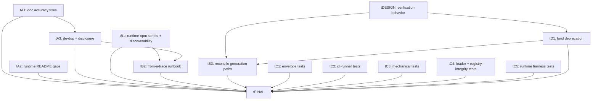

# Plan: eval-pipeline-sweep

## Goal
A documentation, runbook, and test-coverage sweep of the three peer evaluation
pipelines — blueprint eval (`evaluation/pipeline/`, npm `eval`), trace eval
(`evaluation/trace/`, npm `eval:trace` + `eval:trace:extract`), and the
runtime narrator harness (`evaluation/runtime/`, currently script-less and
under-surfaced). The sweep makes the docs match the code, makes all three
pipelines discoverable and their user workflows runnable from the docs alone,
back-fills unit tests for the untested deterministic core of the blueprint and
runtime harnesses, and lands the long-pending deletion of the deprecated
single-prompt evaluator.

## Outcomes
Observable, specific, testable, bounded. The final test card verifies these.

1. **Docs match code.** No evaluation doc claims a mechanical check name,
   analyzer implementation state, retry-attempt outcome value, or trace
   bare-search reveal semantic that contradicts the code. Concretely: the
   documented mechanical-check set is exactly
   `brief_schema_valid, blueprint_schema_valid, culprit_count_matches_brief,
   location_count_matches_brief, character_count_matches_brief,
   red_herring_count_matches_brief, no_orphan_clues, requires_satisfiable`
   (no `mustInclude`, no cover-up check); no doc says analyzers are "None …
   implemented today"; the generation-attempt outcome enum is documented as
   `ok | cli_fail | parse_fail`; and no doc describes bare-search reveal as a
   strict array "prefix".

2. **All three pipelines are discoverable from a top-level entry point.** The
   runtime harness has npm scripts (`eval:runtime`, `eval:runtime:rejudge`,
   `eval:cases-from-trace`) alongside the existing `eval`, `eval:trace`,
   `eval:trace:extract`; `CLAUDE.md`'s evaluation reading list and
   `QUICKSTART.md` both point at all three pipelines including the runtime one.

3. **Each of the four user workflows is runnable from the docs alone,
   prerequisites included.** The workflows: (a) generate + eval a blueprint;
   (b) eval an existing blueprint; (c) extract a runtime case from a played
   trace; (d) eval a runtime case. The docs state, in one canonical place each
   and referenced from the others: the `claude` CLI as an authenticated hard
   prerequisite for generation and every judge/CLI backend; the
   `SERVICE_ROLE_KEY` provenance for `eval:trace:extract` (from
   `npx supabase status`, not deploy's key) with the stack-running / session-
   exists prereqs; and an end-to-end "from a played trace" runbook wiring
   `eval:trace:extract` → `cases-from-trace` → runtime `run`.

4. **The untested deterministic core has unit tests.** New Vitest unit tests in
   `tests/api/unit/` cover: blueprint `combineDimension` (pass/fail/error/
   skipped matrix), `buildEnvelope` summary tallies, `countExtraAttempts`;
   `cli-runner` `runCliWithRetries` attempt accounting + `extract_path`
   dotted-walk + non-string guard; mechanical `findOrphanClues` (incl.
   sub-location traversal) + the four count-vs-brief checks; generic
   dimension-id → schema/analyzer resolution + named-`schema`-export
   enforcement; runtime `cases-from-trace` case-generation helpers and
   `roles.mjs` logic; and a registry-integrity test that guards both
   `evaluation/dimensions/registry.json` and
   `evaluation/trace/dimensions/registry.json`. All run in `npm run test:unit`.

5. **The deprecated single-prompt evaluator is removed.**
   `packages/shared/src/evaluation/{prompt,schema,index}.ts` and
   `docs/blueprint-evaluation.md` no longer exist; `CLAUDE.md`'s eval reading
   list no longer references the removed doc; and no repo module imports the
   removed evaluator — in particular `scripts/generate-blueprint.mjs`'s
   post-generation verification no longer depends on it. The full quality gate
   passes after removal.

## Orchestration
- Status: enabled
- Plan slug (for PR filtering): `eval-pipeline-sweep`
- Plan root: `docs/plans/eval-pipeline-sweep/`
- Integration branch: `main`
- Host: `github`
- Host access: `gh`
- Quality-gate command: `npm test` (runs `node scripts/run-test-gate.mjs`) for
  any non-documentation change. For documentation-only tasks the gate is the
  repo's doc-validation policy (command accuracy, path/link correctness,
  cross-document consistency, stale-reference sweep) per `docs/testing.md`
  → "Documentation-Only Changes" and `CLAUDE.md` → "Documentation
  Maintenance" — no test suite. Non-doc cards here touch only
  `evaluation/**/*.mjs`, `package.json`, and `tests/api/unit/**`, so they run
  in the Phase 1 unit gate (Vitest `test:unit`) and need no Supabase; the
  `MYSTERY_CLOUD_SESSION` Phase 2 waiver rules therefore do not affect them.
- Builder concurrency cap: 4
- Reviewer concurrency cap: unbounded
- Deviations from default protocol: none.

## DAG

## Tasks
- [tDESIGN: post-generation verification behavior after deprecation](tasks/tDESIGN.md) — design
- [tA1: doc accuracy fixes (blueprint + trace READMEs)](tasks/tA1.md) — build
- [tA2: runtime README gaps](tasks/tA2.md) — build
- [tA3: de-duplicate docs + fix progressive-disclosure leaks](tasks/tA3.md) — build
- [tB1: runtime npm scripts + top-level discoverability](tasks/tB1.md) — build
- [tB2: end-to-end "from a played trace" runbook + prerequisites](tasks/tB2.md) — build
- [tB3: reconcile the two blueprint-generation paths](tasks/tB3.md) — build
- [tC1: unit tests for pipeline/envelope.mjs](tasks/tC1.md) — build
- [tC2: unit tests for pipeline/cli-runner.mjs](tasks/tC2.md) — build
- [tC3: unit tests for checks/mechanical.mjs](tasks/tC3.md) — build
- [tC4: unit tests for loader resolution + registry integrity](tasks/tC4.md) — build
- [tC5: unit tests for the runtime harness core](tasks/tC5.md) — build
- [tD1: land the deprecation — delete old evaluator + migrate callers](tasks/tD1.md) — build
- [tFINAL: verify plan outcomes](tasks/tFINAL.md) — build (final test card)

## Deviations log

<empty until first merge>
